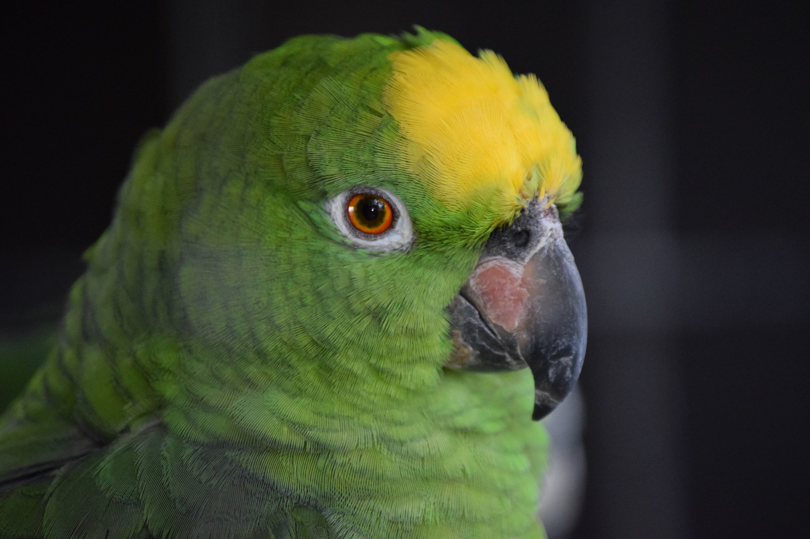

# Babl


# Todo 21 Dec 2024
- [] locally train and query T5 model from the command line 
- [] retrieve bloom and LLaMA models and apply the same 
- [] Django full-stack (https://dev.to/documatic/build-a-chatbot-using-python-django-46hb) to allow for interaction with models, storing and retriewing of conversations
- [] Write tests 
- [] installable python package
- [] Automated testing with GH actions 

## Overview 
Causally and masked pretrained deep learning networks have been applied to a variety of domains, particularly [natural language processing](https://en.wikipedia.org/wiki/Natural_language_processing). Babl is a library which allows users to interact with a collection of large language models locally through the web browser. Babl also demonstrates how to [fine-tune](https://en.wikipedia.org/wiki/Fine-tuning_(deep_learning)) these models on down-stream applications. This fine-tuning is performed on a question and answering dataset create from Wikipedia by Standford academics; [SQuAD](https://arxiv.org/abs/1606.05250). Babl provides access to three models:
1) [T5](https://en.wikipedia.org/wiki/T5_(language_model))
2) [LLaMA](https://en.wikipedia.org/wiki/Llama_language_model)
3) [Bloom](https://en.wikipedia.org/wiki/BLOOM_(language_model))


## Installation 

## Usage 
```
python T5/train.py
```

## Running tests


## Citation 


## Repository structure 
```
.
├── README.md
├── requirements.txt
└── T5
    ├── data_classes.py
    ├── dockerfile.trainingGPU
    ├── eval.py
    ├── read.py
    └── train.py
```

`data_classes.py` <-- these are like your config files, there is also the datacollator in there which is NOT really part of the configuration,but rather part of the data loading pipelines. 

 `read.py` <--- this reads the data and prepares it as input into the model

 `dockerfile.trainingGPU`  <-- this file allows you to deploy your model to a docker client or lets say train the model inside of a container rather than your local machine, you dont need to do this but it is definitely good practice to do it. I know you are from a Hardware background, and the idea of the _image_ presists throughout all of tech, but I strongly recommend to isolate the docker image in your mind as a special general purpose image that you, or I, can develop. I would urge you to learn about docker. really really badly, if you are not familiar with it. That file describes an operating system, alongside the code from this repo that needs to be copied into the operating system for the end image created by the dockerfile to contain the application of a question and answering system. Go to a linux machine and install a docker client. Pull images and try to build this image itself, I will help with any issues 

  `eval.py` <--- this contains the logic to evalute the performance of the fine-tuned models

 `train.py` <-- This trains the model. 

The example giving will fine tune the T5 transformer network on a question and answering task with the addition of providing additional context to the encoder to prove or disprove **if** the additional contexts improves the overall performance of the network. 

# How to run
```
python T5/train.py
```
Will initialse the fitting of the model. You wont be able to do it until I give you the dataset. 

# What is SQuAD?
Stanford Question Answering Dataset (SQuAD) is a reading comprehension dataset, consisting of questions posed by crowdworkers on a set of Wikipedia articles, where the answer to every question is a segment of text, or span, from the corresponding reading passage, or the question might be unanswerable.

This model fine tunes on this data set, i.e. `data/50k.jsonl` corresponds to the SQuAD training dataset. 

Often in various domains there is a standard dataset all ml engineers compare their state of the art models against to make the model comparisions fair. For question and answer that dataset is the SQuAD dataset. 

You may need to download it from here https://rajpurkar.github.io/SQuAD-explorer/ and place it in the correct location as expected from the `train.py` file. I haven't run this repo, so I cannot tell you if it is just a case of dropping the dataset into the location and running the script. But, trust me it will train and evaluate your fine-tuned version of T5 on the SQuAD dataset. 


## What can I say to make it sound like I am well-versed on the subject of NLP 
 One thing you can say Ian is that you do not know whether the original dataset used to fit the T5 model contained examples from the fine-tuning dataset; SQuAD. If it does, the metrics you gained from the validation step arent as reliable as they seem  - you are not supposed to have overlap between training, validation and testing sets. If would be like giving a student a HW question and re-using that HW question in an exam to try to evaluate the students underlying abilities - I am sure you understand that this is not a fair evaluation. But the dataset used to fit the T5 is so large that its hard to tell and requires fine-grained analysis of it. 

 SAY THAT AND PEOPLE WONT QUESTION YOU IAN!!!!!!


# Data 
A dataset has been created from Wikipedia. 
- it contains questions (**x**) and their ground truth answers (**y**)
- Alongside side these pairs (**x**, **y**), the dataset contains context **c** deemed relevant to answering the underlying question 
- i.e. Sample example ((**x**, **c**), **y**). 

# Experiment goal
- The goal of the experiment is to prove or disprove if providing the encoder of the network with the additional context **c** alongside the question **x** improves the overall performance of the generator (the component of the network that produces **y**)

- I.e. will the performance metrics improve, w.r.t the second model trained in dataset 2), if two models are fined tuned on two different datasets:
1) Dataset: (**x**,**y**)
2) Dataset: ([**x**,**c**],**y**)
- Where we concatenate the question **x** with the context **c** in the latter dataset. 

